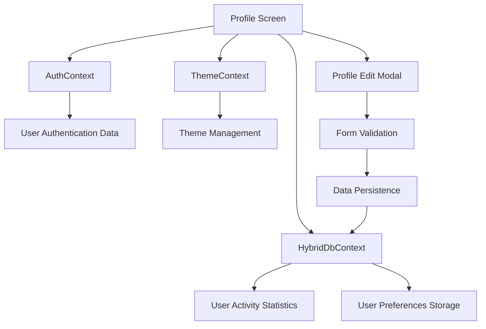

# Design Document

## Overview

The user profile feature will be implemented as a comprehensive profile management system that integrates seamlessly with the existing React Native/Expo application architecture. The design leverages the current authentication system (Instant DB), hybrid database context (Turso + SQLite), and theme management to provide a cohesive user experience.

The profile system will be built as a tab-based interface that replaces the current routing error by properly implementing the "profile" route referenced in the tab layout. The design follows the existing app patterns and maintains consistency with the current UI components and styling approach.

## Architecture

### Component Hierarchy
```
Profile Tab (profile.tsx)
├── ProfileHeader (displays user info and avatar)
├── ProfileStats (shows user activity statistics)  
├── ProfileActions (edit profile, settings, logout)
└── ProfileSettings (preferences and account management)
    ├── PersonalInfoSection
    ├── PreferencesSection
    ├── SecuritySection
    └── DataSection
```

### Data Flow


### State Management
- **Authentication State**: Managed by existing `AuthContext` for user data and session management
- **Profile Data**: Stored in hybrid database (Turso/SQLite) for offline-first approach
- **UI State**: Local component state for form inputs, modal visibility, and loading states
- **Theme State**: Managed by existing `ThemeContext` for appearance preferences

## Components and Interfaces

### Core Components

#### 1. ProfileScreen (`app/(tabs)/profile.tsx`)
Main profile screen component that serves as the container for all profile functionality.

**Props**: None (uses contexts)
**State**: 
- `isEditModalVisible: boolean`
- `isLoading: boolean`
- `profileStats: UserStats | null`

**Key Methods**:
- `loadUserStats()`: Fetches user activity data from hybrid database
- `handleEditProfile()`: Opens profile edit modal
- `handleLogout()`: Initiates logout flow

#### 2. ProfileHeader Component
Displays user avatar, name, email, and basic info at the top of the profile screen.

**Props**:
```typescript
interface ProfileHeaderProps {
  user: User;
  onEditPress: () => void;
  isLoading?: boolean;
}
```

#### 3. ProfileEditModal Component
Modal component for editing user profile information with form validation.

**Props**:
```typescript
interface ProfileEditModalProps {
  visible: boolean;
  user: User;
  onClose: () => void;
  onSave: (updates: UserProfileUpdates) => Promise<void>;
}
```

#### 4. ProfileStats Component
Displays user activity statistics and engagement metrics.

**Props**:
```typescript
interface ProfileStatsProps {
  stats: UserStats;
  isLoading?: boolean;
}
```

#### 5. ProfileSettings Component
Comprehensive settings panel with sections for preferences, security, and data management.

**Props**:
```typescript
interface ProfileSettingsProps {
  user: User;
  onThemeChange: (theme: ThemeMode) => void;
  onPreferenceChange: (key: string, value: any) => void;
}
```

### Data Models

#### UserProfile Interface
```typescript
interface UserProfile {
  id: string;
  email: string;
  displayName?: string;
  firstName?: string;
  lastName?: string;
  avatar?: string;
  bio?: string;
  preferences: UserPreferences;
  createdAt: string;
  updatedAt: string;
}
```

#### UserPreferences Interface
```typescript
interface UserPreferences {
  theme: ThemeMode;
  notifications: {
    push: boolean;
    email: boolean;
    inApp: boolean;
  };
  privacy: {
    profileVisibility: 'public' | 'private';
    activityVisibility: boolean;
  };
  language: string;
  timezone: string;
}
```

#### UserStats Interface
```typescript
interface UserStats {
  issuesCreated: number;
  issuesAssigned: number;
  commentsPosted: number;
  itemsManaged: number;
  notesCreated: number;
  lastActiveDate: string;
  joinDate: string;
  streakDays: number;
}
```

### Database Schema Extensions

#### User Profiles Table (Turso/SQLite)
```sql
CREATE TABLE IF NOT EXISTS user_profiles (
  id TEXT PRIMARY KEY,
  user_id TEXT NOT NULL UNIQUE,
  display_name TEXT,
  first_name TEXT,
  last_name TEXT,
  avatar_url TEXT,
  bio TEXT,
  created_at TEXT NOT NULL,
  updated_at TEXT NOT NULL,
  synced_to_instant BOOLEAN DEFAULT FALSE
);
```

#### User Preferences Table (Turso/SQLite)
```sql
CREATE TABLE IF NOT EXISTS user_preferences (
  id INTEGER PRIMARY KEY AUTOINCREMENT,
  user_id TEXT NOT NULL UNIQUE,
  theme TEXT DEFAULT 'system',
  notifications_push BOOLEAN DEFAULT TRUE,
  notifications_email BOOLEAN DEFAULT TRUE,
  notifications_in_app BOOLEAN DEFAULT TRUE,
  privacy_profile_visibility TEXT DEFAULT 'public',
  privacy_activity_visibility BOOLEAN DEFAULT TRUE,
  language TEXT DEFAULT 'en',
  timezone TEXT DEFAULT 'UTC',
  updated_at TEXT NOT NULL
);
```

## Error Handling

### Authentication Errors
- **Unauthenticated Access**: Redirect to sign-in screen using existing auth flow
- **Token Expiration**: Automatic refresh or logout with user notification
- **Network Errors**: Display offline mode with cached data

### Data Persistence Errors
- **Database Write Failures**: Show error toast and retry mechanism
- **Sync Failures**: Queue changes for later sync with visual indicators
- **Validation Errors**: Inline form validation with clear error messages

### UI Error States
- **Loading States**: Skeleton screens and loading indicators
- **Empty States**: Encouraging messages for new users
- **Network Offline**: Offline mode indicators with cached data

## Testing Strategy

### Unit Tests
- **Profile Data Service**: Test CRUD operations for user profiles and preferences
- **Form Validation**: Test input validation logic and error handling
- **Statistics Calculation**: Test user activity aggregation functions
- **Theme Integration**: Test theme switching and persistence

### Integration Tests
- **Authentication Flow**: Test profile access with different auth states
- **Database Sync**: Test offline/online data synchronization
- **Navigation**: Test tab navigation and modal interactions
- **Context Integration**: Test interaction between Auth, Theme, and HybridDb contexts

### Component Tests
- **Profile Screen Rendering**: Test component rendering with different user states
- **Edit Modal Functionality**: Test form submission and validation
- **Settings Persistence**: Test preference changes and storage
- **Statistics Display**: Test stats calculation and display

### End-to-End Tests
- **Complete Profile Flow**: Test full user journey from login to profile management
- **Offline Functionality**: Test profile access and editing in offline mode
- **Theme Switching**: Test theme changes across the entire app
- **Data Consistency**: Test data integrity across app restarts and syncs

## Implementation Considerations

### Performance Optimizations
- **Lazy Loading**: Load profile stats and preferences on demand
- **Image Caching**: Cache user avatars for offline access
- **Debounced Updates**: Debounce preference changes to reduce database writes
- **Memoization**: Use React.memo for expensive profile components

### Accessibility
- **Screen Reader Support**: Proper accessibility labels and hints
- **Keyboard Navigation**: Support for external keyboard navigation
- **High Contrast**: Respect system accessibility preferences
- **Font Scaling**: Support for dynamic font sizing

### Security Considerations
- **Data Validation**: Server-side validation for all profile updates
- **Input Sanitization**: Sanitize user inputs to prevent XSS
- **Privacy Controls**: Respect user privacy preferences
- **Secure Storage**: Use secure storage for sensitive preferences

### Offline Support
- **Cached Profile Data**: Store profile information locally for offline access
- **Queued Updates**: Queue profile changes when offline for later sync
- **Conflict Resolution**: Handle conflicts when syncing offline changes
- **Visual Indicators**: Show sync status and offline mode clearly